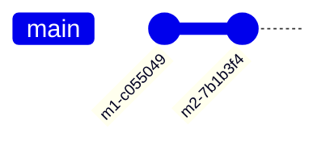
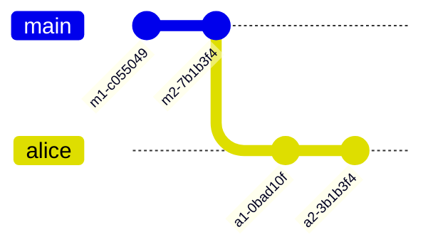
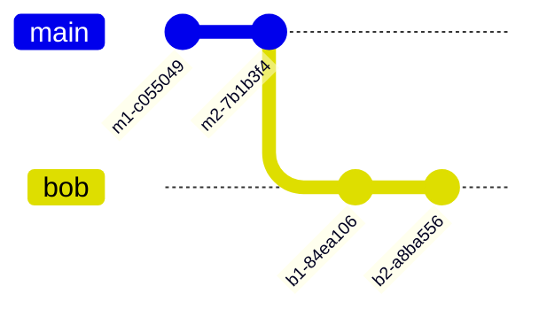
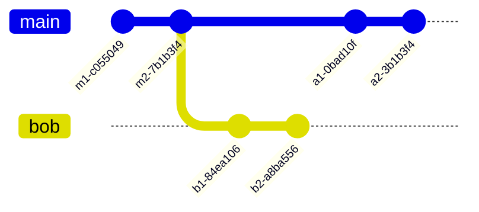
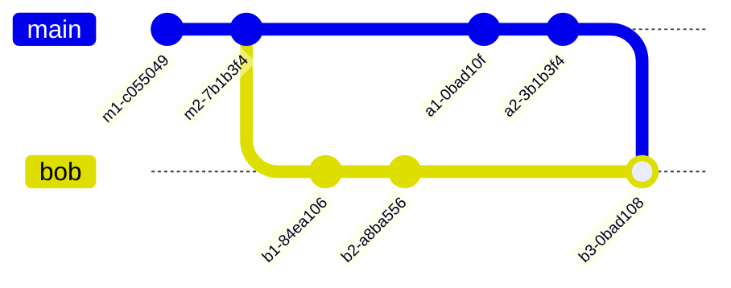
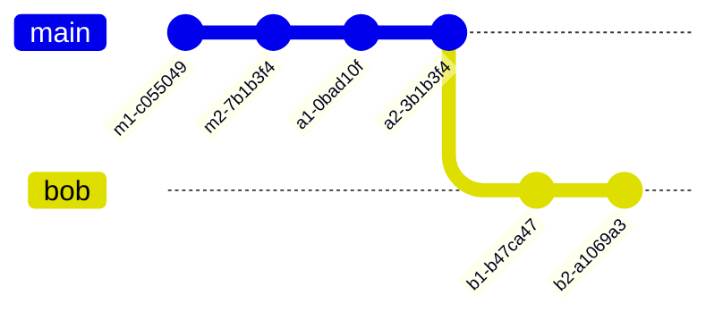
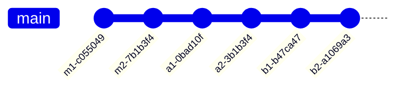

# Git best practices

System Engineering Project 25-26

<https://hogenttin.github.io/git-hogent-gids/>

-v-

## Contents

- Config check
- Commit messages
- Merge vs rebase
- Solving conflicts

-v-

## Prerequisites

- Git client installed
- Github account linked to HOGENT email address
- Git basics: `clone`, `status`, `add`, `commit`, `push`/`pull`

---

# Config check

- Do this on *each* system where you use Git, once
- Use Git Bash, preferrably
- This is essential to prove your contribution!

-v-

## Is Git configured correctly?

You should at least see:

```console
$ git config --global --list
user.name=Johnny Tables
user.email=johnny.tables@student.hogent.be
push.default=simple
```

-v-

## Fix, if necessary

```console
$ git config --global --set user.name 'Johnny Tables'
$ git config --global --set user.email 'johnny.tables@student.hogent.be'
$ git config --global --set push.default simple
```

Or, edit `~/.gitconfig` (Windows INI file format)

-v-

## Do you have an SSH key?

You should at least see:

```console
$ ls ~/.ssh/
id_ecdsa  id_ecdsa.pub
```

-v-

## Fix, if necessary

```console
$ ssh-keygen
...
$ cat ~/.ssh/id_ecdsa.pub
...
```

Copy the contents of your public key and [register in Github](https://github.com/settings/keys).

---

# Commit messages


-v-

## You know what I'm talking about...


Obligatory XKCD reference ([#1296](https://m.xkcd.com/1296/))

-v-

## Start writing informative commit messages!

- Communicate with teammates & coaches
- Communicate with your future self!
- Keep track of your contributions

-v-

## Possible approaches

- [How to Write a Git Commit Message](https://cbea.ms/git-commit/)
- [Conventional Commits](https://www.conventionalcommits.org/en/v1.0.0/)
- Refer to your Ticketing system (JIRA)

-v-

## How to write a commit message

- Limit subject to 50 chars
- Capitalize subject line
- Do not end subject line with a period
- Use imperative mode
    - (does not work well in Dutch)

(other guidelines concern commit message body)

-v-

## Conventional Commits

```text
<type>[optional scope][!]: description
```

- Type: `fix:`, `feat:`, `chore:`, `docs:`, `refactor:`, ...
- Scope: e.g. module name, service `fix(dns)`, `feat(dhcp)`, `docs(dc)`, ...
- Exclamation mark: draw attention to breaking change

(types are better suited to dev than ops)

-v-

## Decide on a policy!

- Use Git like a pro!
- E.g. each commit should contain JIRA ticket number

---

# Merge vs rebase

See: <https://hogenttin.github.io/git-hogent-gids/merge-rebase/>

-v-

## How merge works

Initial situation, `main` branch on Github:



-v-

## Alice makes some changes



-v-

## Bob makes some changes



-v-

## Alice pushes first

The situation for Bob:




-v-

## Bob pushes next

But has to `pull` first!



-v-

## Disadvantages

- Commit history becomes messy
- Hard to keep track

-v-

## Use rebase instead!

`$ git pull --rebase`



-v-

## Then push




---

# Solving conflicts


