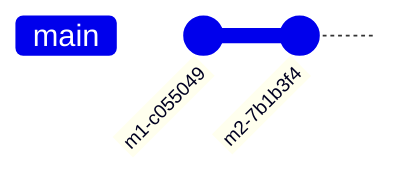
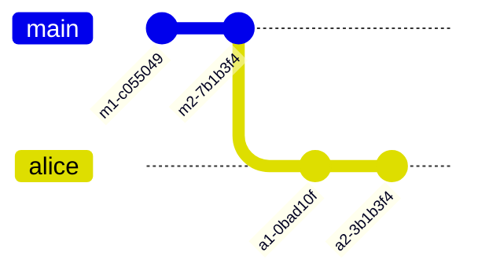
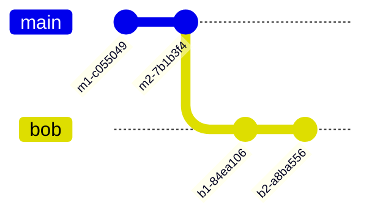
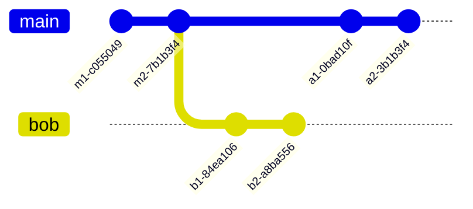
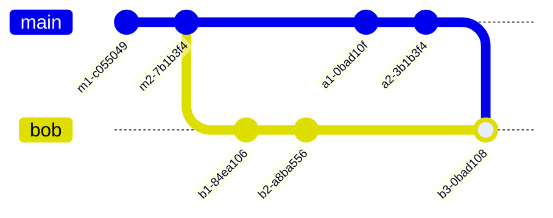
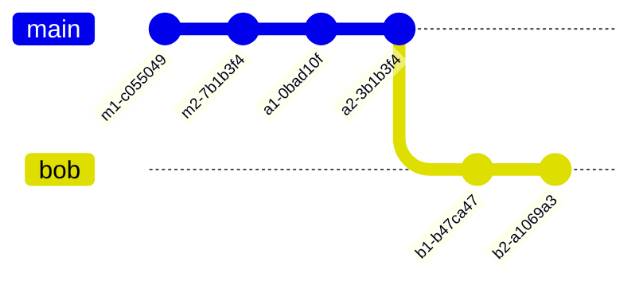
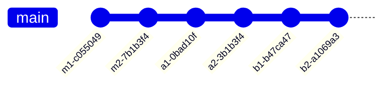

<center>


</center>

---

# Git best practices

System Engineering Project 25-26

<https://hogenttin.github.io/git-hogent-gids/>

-v-

<center>


Source: [XKCD #1597](https://xkcd.com/1597/)

</center>

-v-

## Contents

- Config check
- Commit messages
- Merge vs rebase
- Branches
- Some other advice

-v-

## Prerequisites

- Git (CLI) client installed
- Github account linked to HOGENT email address
- Git basics: `clone`, `status`, `add`, `commit`, `push`/`pull`

---

# Config check

- Do this on *each* system where you use Git, once
- This is essential to prove your contribution!

-v-

## Is Git configured correctly?

You should at least see:

```console
$ git config --global --list
user.name=Johnny Tables
user.email=johnny.tables@student.hogent.be
push.default=simple
```

-v-

## Fix, if necessary

```console
$ git config --global --set user.name 'Johnny Tables'
$ git config --global --set user.email 'johnny.tables@student.hogent.be'
$ git config --global --set push.default simple
```

Or, edit `~/.gitconfig` (Windows INI file format)

-v-

## Do you have an SSH key?

You should at least see:

```console
$ ls ~/.ssh/
id_ecdsa  id_ecdsa.pub
```

-v-

## Fix, if necessary

```console
$ ssh-keygen
...
$ cat ~/.ssh/id_ecdsa.pub
...
```

Copy the contents of your public key and [register in Github](https://github.com/settings/keys).

---

# Commit messages

-v-

## You know what I'm talking about...


Source: [XKCD #1296](https://m.xkcd.com/1296/)

-v-

## Start writing informative commit messages!

- Communicate with teammates & coaches
- Communicate with your future self!
- Keep track of your contributions

-v-

## Possible approaches

- [How to Write a Git Commit Message](https://cbea.ms/git-commit/)
- [Conventional Commits](https://www.conventionalcommits.org/en/v1.0.0/)
- Refer to your Ticketing system (JIRA)

-v-

## How to write a commit message

- Limit subject to 50 chars
- Capitalize subject line
- Do not end subject line with a period
- Use imperative mode
    - (does not work well in Dutch)

(other guidelines concern commit message body)

-v-

## Conventional Commits

```text
<type>[optional scope][!]: description
```

- Type: `fix:`, `feat:`, `chore:`, `docs:`, `refactor:`, ...
- Scope: e.g. module name, service `fix(dns)`, `feat(dhcp)`, `docs(dc)`, ...
- Exclamation mark: draw attention to breaking change

(types are better suited to dev than ops)

-v-

## Decide on a policy!

- Use Git like a pro!
- E.g. each commit should contain JIRA ticket number

---

# Merge vs rebase

See: <https://hogenttin.github.io/git-hogent-gids/merge-rebase/>

-v-

## How merge works

Initial situation, `main` branch on Github:



-v-

## Alice makes some changes



-v-

## Bob makes some changes



-v-

## Alice pushes first

The situation for Bob:




-v-

## Bob pushes next

But has to `pull` first!



-v-

## Disadvantages

- Commit history becomes messy
- Hard to reason about
- Hard to fix mistakes

-v-

## Use rebase instead!

`$ git pull --rebase`



-v-

## Then push



-v-

## Recommendation

```console
$ git config --global set pull.rebase true
$ git config --global set rebase.autostash true
```

And/or define an alias in `.bashrc`/`.bash_profile`

```bash
alias gp='git pull --rebase --autostash'
alias p='git pull --rebase && git push && git push --tags'
```

[More examples here](https://github.com/bertvv/dotfiles/blob/main/bash/dot-bashrc.d/aliases.sh)

---

# Branches considered harmful

-v-

## Branching for "agile" development


-v- 

How is this considered *agile*?

Source: [peerdh.com](https://peerdh.com/blogs/programming-insights/git-branching-strategies-for-agile-development)

-v-

## A flaw in branch diagrams


Attributed to Jonny Leroy, source [martinfowler.com](https://martinfowler.com/articles/branching-patterns.html)

-v-

## Our recommendation

- Don't create branches
- Push to Github often (after rebase!)
- Good task assignments can prevent conflicts

---

# Some other advice

-v-

## Undo?

- Modify last commit: `git commit --amend`
- Undo changes of last commit(s)
    - `git revert HEAD`
    - `git revert <commit>...`
- Also, see <https://ohshitgit.com/>

-v-

## Don't overwrite public history!

Never, **ever** do `git push --force`

-v-

## Take the time to configure (CLI) Git!

- [Aliases](https://github.com/bertvv/dotfiles/blob/main/bash/dot-bashrc.d/aliases.sh)
- [.gitconfig](https://github.com/bertvv/dotfiles/blob/main/git/dot-gitconfig)

-v-

## And finally, don't forget!


<center>

**Any questions? Topics you want us to cover?**

</center>

